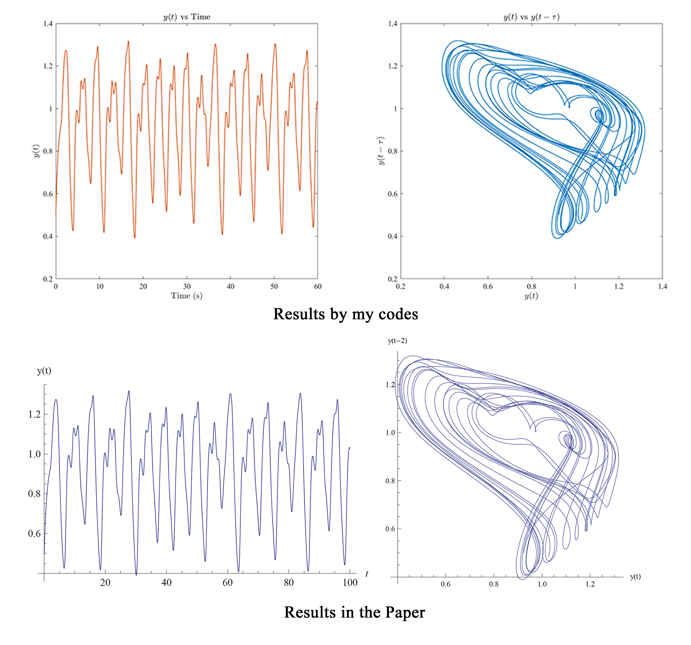
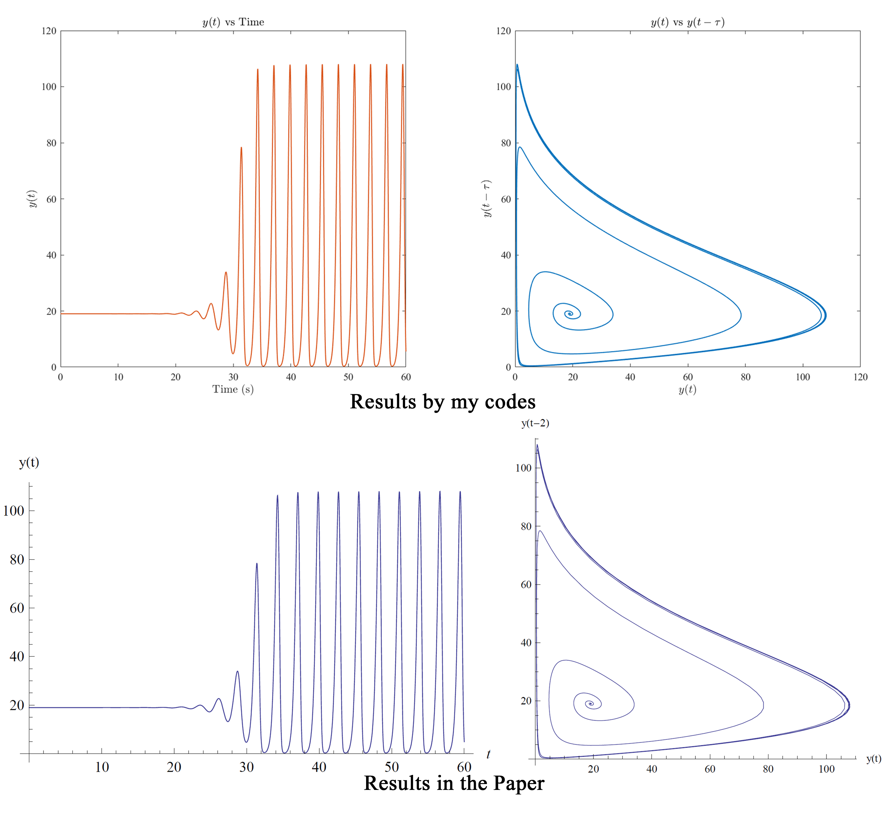
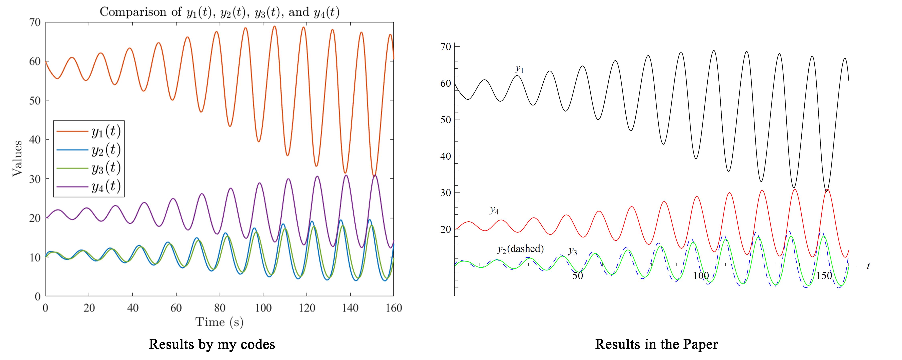

# Fractional Order Differential Equations Solver

This repository contains the unofficial MATLAB implementation of the algorithm presented in the paper ["A Predictor-Corrector Scheme For Solving Nonlinear Delay Differential Equations Of Fractional Order"](https://www.naturalspublishing.com/download.asp?ArtcID=1869) by Bhalekar and Daftardar-Gejji. 

The codebase is divided into three folders, corresponding to examples from Section 4 of the paper, titled "example1", "example2", and "example3".

## Description

This implementation employs a predictor-corrector method for solving nonlinear delay differential equations of fractional order, as outlined in the referenced paper. Each example folder contains three MATLAB scripts: `main.m`, `fde_system.m`, and `plots.m`.

- `fde_system.m`: Defines the fractional order differential equations system.
- `main.m`: The main script for setting parameters and solving the equations.
- `plots.m`: Visualizes the results.

## Structure

- `example1/`: Code for Example 4.1 from the paper.
- `example2/`: Code for Example 4.2.
- `example3/`: Code for Example 4.3.

Each folder includes:

- `main.m`: Main executable script.
- `fde_system.m`: Function defining the equations.
- `plots.m`: Script for plotting results.

## Requirements

- MATLAB version 2022a (likely compatible with other versions as the implementation doesn't rely on specific new features of MATLAB).

## Usage

To run an example:

1. Navigate to the desired example folder (e.g., `example1`).
2. Run the `main.m` script in MATLAB.
3. The script will use `fde_system.m` for equation definitions and `plots.m` for visualizing results.

## Gallery

Here is a visual comparison of some paper results and the results of my code:

## Contributing

Contributions, issues, and feature requests are welcome. Please check the issues page if you want to contribute.

## Reference

The algorithm implemented in this repository is based on the following paper:

> Bhalekar, S.; Daftardar-Gejji, V. A predictor-corrector scheme for solving nonlinear delay differential equations of fractional order. J. Fract. Calc. Appl. 2011, 1, 1–9.

## License

This project is licensed under the MIT License - see the [LICENSE](./LICENSE) file for details.